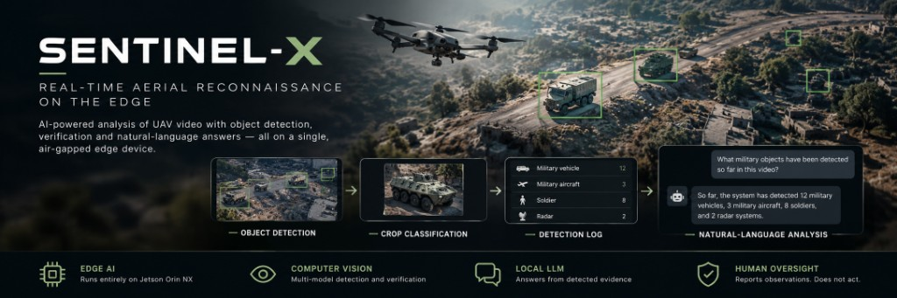
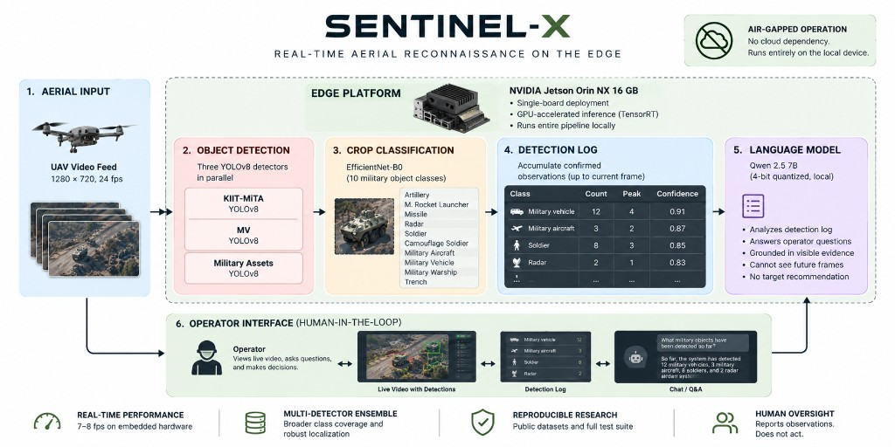

# SENTINEL-X



> **Real-time aerial reconnaissance demonstrator - air-gapped, edge-deployed, human in the loop.**


-000000)


Three YOLOv8 detectors, a fine-tuned EfficientNet-B0 crop classifier, and a locally hosted
Qwen 2.5 7B language model run together on a single NVIDIA Jetson Orin NX 16 GB.
No cloud, no internet, no CPU fallback. Demonstrated live at a defence and security expo in
Essen, September 2026.

---

## Overview

A short aerial video plays in the left panel. Every frame passes through three independent
object detectors on the GPU. Each bounding box is cropped and named by a fine-tuned
EfficientNet-B0, and a running tally - per class, per frame, with peak concurrences - is
maintained throughout playback.

The right panel is a chat window backed by Qwen 2.5 7B running locally through Ollama. The
model receives only the tally up to the frame currently on screen, so it can never reveal
detections the operator has not yet seen. The operator asks questions in natural language.
A person makes every decision.

---

## Architecture



```
Video frame (1280 x 720, 24 fps)
        |
        v
+---------------------------+
|  YOLO detection (GPU)     |   Three independent detectors:
|  - KIIT-MiTA-yolo26s      |   1,700 drone images, 7 classes
|  - MV-yolo26s             |   2,702 images, 3 vehicle classes
|  - military-yolov8n       |   26,315 images, 12 classes
+---------------------------+
        |
        |  IoU dedup: overlapping boxes -> keep highest YOLO confidence
        v
+---------------------------+
|  EfficientNet-B0 (GPU)    |   224 x 224 crops
|  10 output classes        |   Test accuracy: 89.01 % (494 / 555)
|  32 px short-side gate    |   Tiny crops skipped, not misclassified
+---------------------------+
        |
        |  IoU dedup again: overlapping named boxes -> keep highest CNN score
        v
  Unified 10-class label space
  Artillery | Missile | Radar | M. Rocket Launcher | Soldier
  camouflage_soldier | military_aircraft | military_vehicle
  military_warship | trench
        |
        v
+---------------------------+
|  Qwen 2.5 7B (Ollama)     |   4-bit quantized, fully local
|  Context cutoff at        |   Only sees frames <= playhead time
|  the playhead             |   No coordinates, no target advice
+---------------------------+
        |
        v
  Operator chat panel
  Human decides.
```

---

## Engineering Highlights

The competencies this project exercises, and the design decisions behind them:

- **Multi-model ensemble inference.** Three detectors trained on three separate datasets
  run in parallel, and their outputs are fused into one unified 10-class label space with
  IoU-based deduplication - broader class coverage than any single detector, without double
  counting.

- **Two-stage detect-then-verify pipeline.** YOLO localizes; EfficientNet-B0 independently
  confirms each crop. A box that the classifier cannot name is dropped, so every counted
  observation is agreed on by two models.

- **Edge AI optimization.** TensorRT FP16 engines are compiled from the trained weights on
  the Jetson, roughly halving inference latency versus the PyTorch baseline with no
  meaningful accuracy loss. cuDNN autotuning is enabled and reused across frames.

- **Concurrent, non-blocking architecture.** Video decode, detection, LLM streaming, and GPU
  telemetry each run on their own thread. The detector always processes the freshest frame
  and discards stale ones, so a 24 fps display never stalls behind 7-8 fps inference.

- **Local LLM integration with guardrails.** A 4-bit quantized 7B model runs entirely on
  device via Ollama. A playhead-bounded context window prevents future-frame leakage, and a
  system prompt forbids invented coordinates and target recommendations.

- **Resource-aware model orchestration.** The two vision models load and warm up first; the
  language model loads only afterwards, so they never contend for the 16 GB of unified
  memory during cold start.

- **Production-minded software engineering.** A modular package split by concern, a
  hardware-independent test suite that runs without a GPU, and portable path handling with
  no machine-specific assumptions.

---

## Performance (Jetson Orin NX 16 GB)

| Stage | Time |
|---|---|
| TensorRT FP16 warm pass - KIIT-MiTA-yolo26s | ~17 ms |
| TensorRT FP16 warm pass - MV-yolo26s | ~27 ms |
| TensorRT FP16 warm pass - military-yolov8n | ~28 ms |
| Full pipeline throughput | 7-8 fps |
| Video playback rate | 24 fps |
| EfficientNet-B0 test accuracy | 89.01 % (494 / 555 crops) |

Video is decoded and displayed at 24 fps. Detection runs on a separate thread and draws the
most recently computed overlay on the current frame, so the picture never stutters while the
GPU is busy.

---

## Tech Stack

| Concern | Tool |
|---|---|
| Object detection | YOLOv8 (Ultralytics) |
| Crop classification | EfficientNet-B0 (torchvision pretrained, custom head) |
| Language model | Qwen 2.5 7B Instruct Q4_K_M via Ollama |
| Edge inference | TensorRT 10.7 FP16 (Jetson) |
| GPU compute | CUDA 12, cuDNN benchmark mode |
| Video | OpenCV |
| Interface | Tkinter (no web server, no browser) |
| Language | Python 3.11 |

---

## Project Structure

```
run.py               entry point
requirements.txt     Python dependencies
src/
  labels.py          unified CNN class list, YOLO-to-CNN name map, path constants
  detection.py       YOLO inference, EfficientNet crop classifier, IoU dedup
  chat.py            Qwen streaming via Ollama HTTP, context builder
  gpu.py             GPU utilization reader (nvidia-smi + Jetson SoC sysfs fallback)
  window.py          Tkinter demo window: video pane, chat pane, timeline
tests/               hardware-independent unit tests
docs/
  technical-description.md   full technical write-up
```

---

## Hardware

The demonstrator runs on a single **NVIDIA Jetson Orin NX 16 GB** with no attached monitor;
the window is forwarded to a connected laptop over SSH X11 (`ssh -Y`). On a development x86
machine the same codebase runs unchanged, using the PyTorch `.pt` weights directly. On the
Jetson, a TensorRT `.engine` beside a `.pt` is loaded in its place.

---

## Getting Started

**Prerequisites**

- A CUDA-capable NVIDIA GPU (detection will not run on CPU)
- [Ollama](https://ollama.com) running locally on port `11434`
- The trained weights and demonstration video (kept out of version control)

**1. Clone the repository**

```bash
git clone https://github.com/ShadAhammed/Sentinel.git
cd Sentinel
```

**2. Install dependencies**

```bash
# x86 workstation with CUDA 12.x
pip install torch torchvision --index-url https://download.pytorch.org/whl/cu121
pip install -r requirements.txt
```

On the Jetson Orin NX, `torch` and `torchvision` ship with JetPack - install only
`pip install -r requirements.txt`.

**3. Provide the model weights and video**

```
Data/
  EffNet_b0.pt
  video/combined_drone.mp4
  YOLO-Models-Final/
    KIIT-MiTA-yolo26s.pt
    MV-yolo26s.pt
    military-yolov8n.pt
```

On the Jetson, place a `.engine` file beside each `.pt` to use the TensorRT build.

**4. Pull the language model**

```bash
ollama pull qwen2.5:7b-instruct-q4_K_M
```

**5. Launch**

```bash
python run.py
```

The application warms the detectors first, then loads the language model, so the two never
contend for GPU memory at startup. Press **Play** to begin detection; the chat unlocks once
the greeting finishes.

---

## Datasets

The detectors were trained on publicly licensed datasets. Full citations appear in the
**Credit** tab of the application and in
[docs/technical-description.md](docs/technical-description.md).

| Detector | Dataset | License |
|---|---|---|
| KIIT-MiTA-yolo26s | KIIT-MiTA (Chowdhury, Mendeley Data, DOI 10.17632/drjmrf5kk5.1) | Education and research only |
| military-yolov8n | Military Assets Dataset (Ryan Madhuwala, Kaggle) | CC BY 4.0 |
| MV-yolo26s | Military Vehicle Recognition (Roboflow Universe, v7) | CC BY 4.0 |

---

## Scope

SENTINEL-X is a research demonstrator. It reports observations to a human operator; it does
not recommend targets, generate coordinates, or take any action. Weights, video, and datasets
are not committed to this repository.
